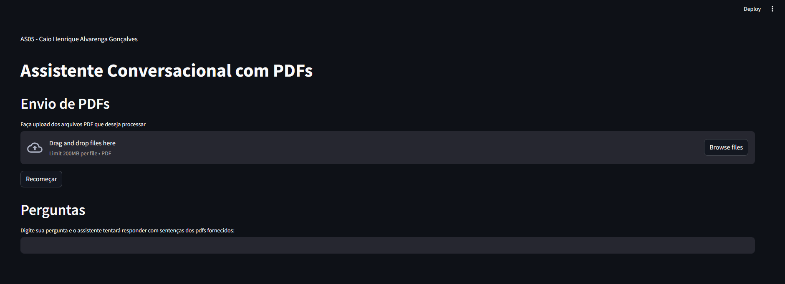

# **Tópicos em Computação III: Text Mining and Analysis**
# AS05: Implementação de Assistente Conversacional Baseado em LLM
Aluno: Caio Henrique Alvarenga Gonçalves

---
## **Problema**

Implementar um assistente conversacional baseado em LLM que seja capaz de indexar vetores (embeddings textuais) de uma coleção de documentos PDF para posteriormente responder a perguntas feitas através de uma interfce de conversação.

## **Produto**

A ferramenta desenvolvida esta hospedada na plataforma streamlit e pode ser acessada a partir do link: https://as05-caio-alvarenga.streamlit.app/

### **Instruções para Compilação Local**

Se você deseja executar o código localmente em vez de utilizar o link para o app hospedado, siga as instruções abaixo (ou assista [este vídeo](https://youtu.be/u-Cdinq5BHI)) para configurar e executar o projeto em sua máquina.

#### **1. Pré-requisitos**
Antes de começar, certifique-se de ter o seguinte instalado:
- **Python 3.8 ou superior**
- **pip** (gerenciador de pacotes do Python)

#### **2. Clonar o Repositório**
Clone o repositório para sua máquina local (ou use os arquivos do google drive enviados pelo canvas):
```
git clone https://github.com/seu-usuario/nome-do-repositorio.git
cd nome-do-repositorio
```
#### **4. Instalar dependências**
Em um terminal (prompt de comando) aberto no diretório raiz do projeto, digite o comando:

``` pip install -r requirements.txt```

#### **5. Executar a aplicação**
Para iniciar a aplicação use o seguinte comando: 

``` streamlit run app.py```

Após executado, a aplicação poderá ser acessada através do link ```http://localhost:8501``` em seu navegador.


---


